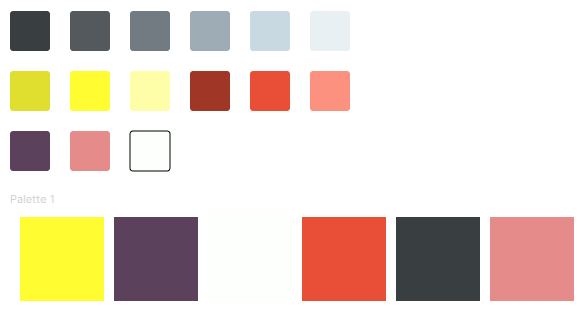

# Resume-Showcase
A website where we showcase/learn Front-End coding skills, and display our resumes.

# Set Up
https://reactjs.org/docs/add-react-to-a-website.html#add-jsx-to-a-project
Adding JSX to project
- Pre-req: Have node.js

In repo, run in terminal: 
- `npm init -y`
- `npm install babel-cli@6 babel-preset-react-app@3`

Then create folder `src`
- `npx babel --watch src --out-dir . --presets react-app/prod`

# Tech Stack
- Front-End: React JS
- Back-End: Firebase (if needed)

# Colour Palette (UI/UX)


# Coding Style
- Camel case
- An Example

# Semantic Commit Messages 
(from https://gist.github.com/joshbuchea/6f47e86d2510bce28f8e7f42ae84c716)

See how a minor change to your commit message style can make you a better programmer.

Format: `<type>(<scope>): <subject>`

`<scope>` is optional

## Example

```
feat: add hat wobble
^--^  ^------------^
|     |
|     +-> Summary in present tense.
|
+-------> Type: chore, docs, feat, fix, refactor, style, or test.
```

More Examples:

- `feat`: (new feature for the user, not a new feature for build script)
- `fix`: (bug fix for the user, not a fix to a build script)
- `docs`: (changes to the documentation)
- `style`: (formatting, missing semi colons, etc; no production code change)
- `refactor`: (refactoring production code, eg. renaming a variable)
- `test`: (adding missing tests, refactoring tests; no production code change)
- `chore`: (updating grunt tasks etc; no production code change)
